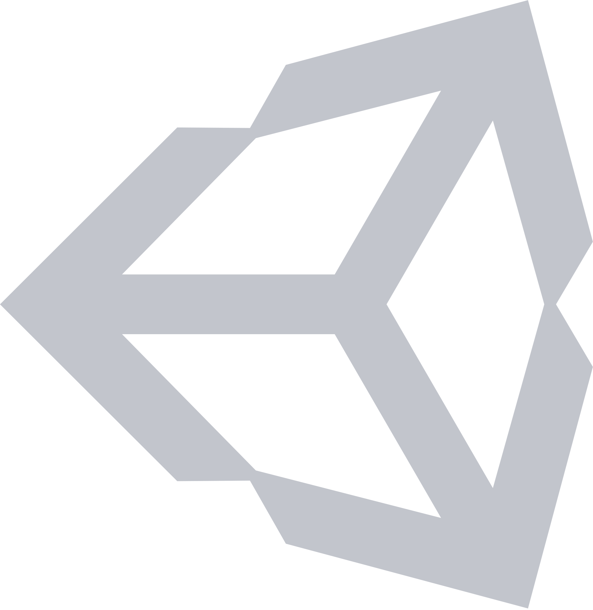

### Hi there, I'm Gyeonghun 

## I'm a passionate Student, Learner, and Developer!!

### 🧐 &nbsp; More About Me:

- 🔭 &nbsp; I’m currently concentrating on open source contributions
- :computer: &nbsp; Most used line of code `git commit -m "Initial Commit"`
- 🤔 &nbsp; I’m looking for help with outstanding blog post ideas.
- 😄 &nbsp; Pronouns: Gyeonghun, Jay, He/Him
- ⚡ &nbsp; Fun fact: I play games and go to the GYM very often.
- 🌱 &nbsp; I’m currently learning blockchain
- 🌈 &nbsp; I'm aiming to elevate people through meaningful service
- 💬 &nbsp; Ask me about anything tech related, I am happy to help;
- 📫 &nbsp; Feel free to ping me on [LinkedIn](https://www.linkedin.com/in/gyeonghun-park-095971193/)

 

### 🔨 &nbsp; Languages and Tools:

  
    
    
    
    </a>
    
  
  <a href="https://www.typescriptlang.org/" target="_blank" style="margin:10px">
    
  
  
  
    
    
    
  
  
  
  

  

  
  
  

 

### 📊 &nbsp; Github Stats

&nbsp;

 

### :mailbox: &nbsp; Reach me out!

